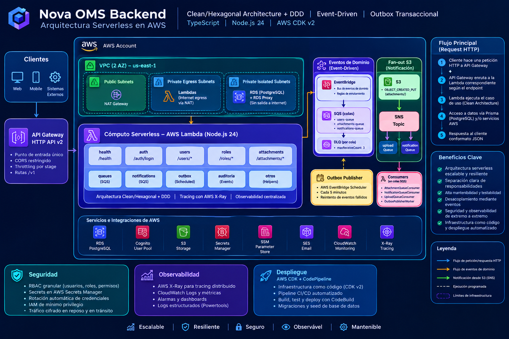
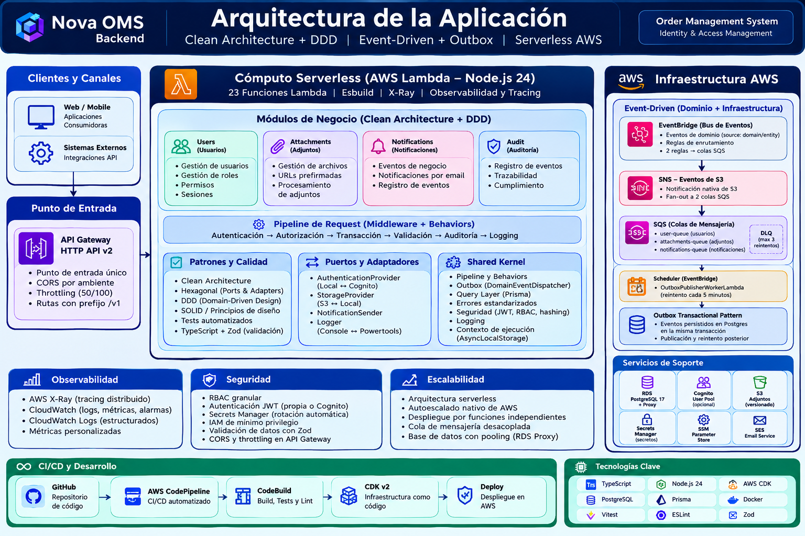
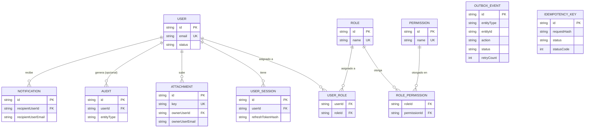

# Nova OMS — Backend

### Tech Stack


Backend serverless de **Nova OMS**, construido en TypeScript sobre AWS CDK con Clean/Hexagonal Architecture + DDD a nivel de código, y una arquitectura orientada a eventos (EventBridge + SNS + SQS, patrón Outbox transaccional) a nivel de infraestructura.

**Adrian Suarez** — Líder Técnico · Arquitecto de Software · Desarrollador Full Stack

## 1. Introducción

Nova OMS es un proyecto de portafolio técnico: el dominio de negocio (Order Management System) es la excusa para demostrar, con código real y desplegable, patrones de arquitectura serverless en AWS de nivel empresarial. Este repositorio implementa hoy el bounded context de **Identity & Access Management** (usuarios, roles, permisos, sesiones, adjuntos, auditoría, notificaciones) de punta a punta — Orders/Catalog/Inventory/Billing son roadmap.

Dos decisiones estructurales sostienen todo lo demás:

- **Clean/Hexagonal Architecture + DDD** a nivel de código — cada módulo replica 4 capas (`domain/application/infrastructure/presentation`), con puertos y adaptadores intercambiables reales (no solo interfaces vacías).
- **Event-driven architecture con patrón Outbox transaccional** a nivel de infraestructura — los eventos de dominio se persisten en la misma transacción que el cambio de datos antes de publicarse a EventBridge, con un worker de reintento independiente.

### Aspectos destacados

- **Infraestructura como código** — dos stacks CDK v2: `ApiStack` (23 Lambdas con tracing X-Ray, API Gateway con throttling, RDS PostgreSQL + RDS Proxy, Cognito, EventBridge con bus + 2 reglas + Scheduler, SNS, 3 colas SQS con sus DLQ y alarmas de CloudWatch, S3, Secrets Manager, SSM, SES) y `PipelineStack` (CodePipeline + CodeBuild para build/test/deploy/migración), reproducibles con `cdk deploy`.
- **Seguridad**: RBAC granular (usuarios/roles/permisos), secretos en Secrets Manager con grants IAM de mínimo privilegio por Lambda, rotación automática (JWT cada 15 días, credenciales de DB cada 30).
- **Patrón Outbox transaccional**: `DomainEventDispatcher` persiste el evento en la misma transacción Postgres que el cambio de datos, con un Lambda de reintento independiente disparado por EventBridge Scheduler.
- **Dos mecanismos de integración conviviendo a propósito** — EventBridge para eventos de dominio propios y SNS para la notificación nativa de S3, demostrando ambos patrones de mensajería en el mismo sistema.
- **Puertos y adaptadores intercambiables** — `AuthenticationProvider` (Local↔Cognito, ambos desplegados e intercambiables por variable de entorno), `StorageProvider`, `NotificationSender` y `Logger` con más de un adaptador implementado, sin tocar casos de uso al cambiar.
- **Pipeline de CI/CD propio** — AWS CodePipeline con stages de build/test/lint, `cdk deploy`, y migración/seed de base de datos vía CodeBuild.
- **Suite de tests** — 56 tests (pipeline de seguridad, capa de queries, casos de uso, patrón Outbox, notificaciones) más tests de integración contra Postgres real.
- **Documentación de arquitectura versionada junto al código** — diagramas, ADRs conversacionales y este mismo README.

## 2. Arquitectura

### Arquitectura de infraestructura

Topología de los recursos AWS desplegados por `NovaOmsApiStack` y el recorrido completo de una request, de cliente a respuesta:

- **Red**: VPC de 2 AZ con tres tipos de subnet — públicas (NAT Gateway), privadas con salida a internet (Lambdas) y privadas aisladas sin salida (RDS + RDS Proxy) — aislando la base de datos del resto del tráfico.
- **Entrada**: API Gateway HTTP API v2 como único punto de entrada, con CORS restringido por ambiente, throttling por stage y prefijo de versión (`/v1`).
- **Cómputo**: 23 funciones Lambda (Node.js 24) agrupadas por módulo de negocio (`health`, `auth`, `users`, `roles`, `attachments`, colas, notificaciones, outbox), cada una siguiendo la misma Clean Architecture a nivel de código.
- **Eventos**: dos mecanismos de mensajería conviviendo a propósito — EventBridge (bus + reglas de enrutamiento) para eventos de dominio propios, y SNS/SQS para la notificación nativa de S3 — ambos con fan-out hacia colas SQS con su DLQ (`maxReceiveCount: 3`), y un `OutboxPublisherWorker` disparado por EventBridge Scheduler como red de reintento del patrón Outbox transaccional.
- **Datos y soporte**: RDS PostgreSQL detrás de RDS Proxy (pooling de conexiones para Lambda), Cognito User Pool, S3 versionado, Secrets Manager con rotación automática, SSM Parameter Store y SES.
- **Observabilidad y despliegue**: tracing distribuido con AWS X-Ray, métricas y logs estructurados vía CloudWatch/Powertools, e infraestructura como código (CDK v2) desplegada por un CodePipeline propio (Source → Build → Deploy → MigrateAndSeed).



### Arquitectura de la aplicación

Organización del código dentro de cada Lambda, independiente de la infraestructura que la invoca:

- **Clean/Hexagonal Architecture + DDD**: cada módulo replica 4 capas (`domain/application/infrastructure/presentation`) — el dominio no conoce Prisma, AWS SDK ni el framework de Lambda, solo sus propios puertos.
- **Pipeline de request declarativo**: `Logging → Authentication → Authorization → RequestValidation → Idempotency → Transaction`, armado por `PipelineBehaviorRegistry` a partir de un `HandlerDescriptor` por endpoint — agregar o quitar comportamiento a una ruta es editar ese descriptor, no el pipeline.
- **Puertos y adaptadores intercambiables**: `AuthenticationProvider`/`IdentityManagementProvider` (Local ↔ Cognito), `StorageProvider` (Local ↔ S3), `NotificationSender` (Console ↔ SES) y `Logger` (Console ↔ Powertools) — swap por variable de entorno, sin tocar casos de uso.
- **Shared kernel transversal**: patrón Outbox (`DomainEventDispatcher`), capa de queries genérica sobre Prisma, manejo de errores estandarizado (`ApplicationError` y subclases), seguridad (JWT, hashing, RBAC) y contexto de ejecución por request vía `AsyncLocalStorage`.
- **Calidad**: TypeScript en modo estricto, validación de esquemas con Zod, principios SOLID, y tests elegidos por riesgo/valor arquitectónico más que por cobertura exhaustiva.
- **Módulos de negocio**: `users` (usuarios/roles/permisos), `attachments` (archivos vía S3), `notifications` (email vía SES) y `audit` — los cuatro construidos sobre el mismo shared kernel, reaccionando a los mismos domain events cuando corresponde.



## 3. Stack tecnológico completo

### Runtime y lenguaje


| Tecnología | Versión | Rol                                                                                   |
| ----------- | -------- | ------------------------------------------------------------------------------------- |
| Node.js     | 24.x     | Runtime de todas las Lambdas                                                          |
| TypeScript  | ^6.0.3   | Lenguaje,`strict` + `noImplicitAny` + `strictNullChecks` + `noUncheckedIndexedAccess` |
| pnpm        | ^11.9.0  | Package manager (forzado vía`devEngines`)                                            |
| esbuild     | ^0.28.1  | Bundling de cada Lambda (`NodejsFunction` de CDK)                                     |
| tsx         | ^4.22.4  | Ejecución TS para`pnpm dev`, la app CDK y scripts                                    |

### Infraestructura como código


| Tecnología   | Versión  | Rol                                       |
| ------------- | --------- | ----------------------------------------- |
| aws-cdk-lib   | ^2.260.0  | Definición de infraestructura AWS        |
| aws-cdk       | ^2.1129.0 | CLI de CDK                                |
| aws-cdk-local | ^3.0.4    | CLI de CDK contra LocalStack (`cdklocal`) |
| constructs    | ^10.6.0   | Base de CDK Constructs                    |

### Base de datos


| Tecnología        | Versión | Rol                                           |
| ------------------ | -------- | --------------------------------------------- |
| PostgreSQL         | 17       | Motor de base de datos (Docker Compose local) |
| Prisma Client      | 7.8.0    | ORM                                           |
| @prisma/adapter-pg | 7.8.0    | Driver adapter Postgres para Prisma           |
| pg                 | ^8.22.0  | Driver Postgres nativo                        |

### Mensajería y eventos AWS (SDK v3)


| Tecnología                               | Versión  | Rol                                                  |
| ----------------------------------------- | --------- | ---------------------------------------------------- |
| @aws-sdk/client-eventbridge               | ^3.1101.0 | Publicación de eventos de dominio (Outbox)          |
| @aws-sdk/client-sqs                       | ^3.1102.0 | Consumo de colas                                     |
| @aws-sdk/client-ses                       | ^3.1115.0 | Envío de notificaciones por email                   |
| @aws-sdk/client-s3                        | ^3.1098.0 | Almacenamiento de adjuntos                           |
| @aws-sdk/s3-request-presigner             | ^3.1098.0 | URLs prefirmadas de subida/descarga                  |
| @aws-sdk/client-secrets-manager           | ^3.1095.0 | Lectura de secretos en runtime                       |
| @aws-sdk/client-cognito-identity-provider | ^3.1096.0 | Adaptador de auth Cognito (implementado y desplegado, activable con `AUTH_PROVIDER=cognito`) |

### Seguridad y auth


| Tecnología    | Versión | Rol                                                            |
| -------------- | -------- | -------------------------------------------------------------- |
| jose           | ^6.2.3   | Firma/verificación de JWT (`LocalAuthenticationProviderImpl`) |
| aws-jwt-verify | ^5.2.1   | Verificación de JWT de Cognito (adaptador alterno)            |
| bcryptjs       | ^3.0.3   | Hashing de contraseñas y refresh tokens                       |

### Validación y HTTP


| Tecnología | Versión | Rol                                                                   |
| ----------- | -------- | --------------------------------------------------------------------- |
| zod         | ^4.4.3   | Validación de esquemas en`presentation/schemas`                      |
| express     | ^5.2.1   | Servidor HTTP local (`pnpm dev`, adapta a los mismos handlers Lambda) |

### Resiliencia

| Tecnología | Versión | Rol                                                                 |
| ----------- | -------- | -------------------------------------------------------------------- |
| cockatiel   | ^4.0.0   | Circuit breaker + retry + timeout (`ResiliencePolicyFactory`), una política por servicio externo compartida entre Cognito y SES |

### Observabilidad


| Tecnología                    | Versión | Rol                                                 |
| ------------------------------ | -------- | --------------------------------------------------- |
| @aws-lambda-powertools/logger  | ^2.33.1  | Logger estructurado (adaptador alterno, no default) |
| aws-xray-sdk-core               | ^3.12.0  | Tracing X-Ray real: instrumenta cada query de Prisma (`PrismaClientFactory.ts`) y los clientes AWS de Cognito/SES (`captureAWSv3Client`) como segmentos propios, combinado con `tracing: lambda.Tracing.ACTIVE` en cada Lambda (CDK). Anota `circuitBreakerState=open` cuando una llamada falla rápido por el circuit breaker. |
| @aws-lambda-powertools/metrics | ^2.33.1  | Métricas custom vía CloudWatch EMF — instancia única en `SharedContainer.metrics`, inyectada donde haga falta (hoy: `ResiliencePolicyFactory`). Se emite (`publishStoredMetrics()`) al final de cada invocación, en los 2 caminos que la usan hoy (`exceptionMiddleware` para HTTP, `SqsLambdaHandler` para SQS) |
| @aws-lambda-powertools/tracer  | ^2.33.1  | Dependencia declarada, sin uso todavía en código — el tracing real corre sobre `aws-xray-sdk-core` directo, no sobre este paquete |

### Testing y calidad de código


| Tecnología         | Versión | Rol                                                |
| ------------------- | -------- | -------------------------------------------------- |
| vitest              | ^4.1.10  | Test runner (unit + integration)                   |
| @vitest/coverage-v8 | ^4.1.10  | Cobertura de tests                                 |
| eslint              | ^10.6.0  | Linter (flat config)                               |
| typescript-eslint   | ^8.62.1  | Integración TS + ESLint                           |
| prettier            | ^3.9.4   | Formateo de código                                |
| husky               | ^9.1.7   | Git hooks (`pre-commit`: `pnpm lint && pnpm test`) |
| lint-staged         | ^17.0.8  | Instalado, sin configuración activa hoy           |

Otras dependencias puntuales: `file-type` (validación de tipo real de archivo en adjuntos), `dotenv` (carga de `.env` en local).

## 4. Arquitectura AWS por componentes

### API Gateway

- **Tipo**: HTTP API v2 (no REST API).
- **Nombre**: `nova-oms-api`.
- **CORS**: habilitado a nivel de gateway (`allowOrigins: ["*"]`, todos los métodos/headers) — pensado para desarrollo, restringir antes de producción.
- **Autenticación/autorización**: delegada completamente al pipeline de cada Lambda (`AuthenticationBehavior`/`AuthorizationBehavior`), no hay authorizer configurado en el gateway.

### Lambdas (23)

Todas Node.js 24, empaquetadas con esbuild vía `NodejsFunction`, nombre final `NovaOms-<Id>`.


| Módulo       | Lambda                                | Entry                                    | Trigger                                                                   |
| ------------- | ------------------------------------- | ---------------------------------------- | ------------------------------------------------------------------------- |
| Health        | `HealthLambda`                        | `src/lambdas/health/get.ts`              | HTTP`GET /health`                                                         |
| Auth          | `AuthLambda`                          | `src/lambdas/auth/login.ts`              | HTTP`POST /auth/login`                                                    |
| Users         | `GetCurrentUserLambda`                | `src/lambdas/users/current.ts`           | HTTP`GET /users/me`                                                       |
| Users         | `GetUserLambda`                       | `src/lambdas/users/get.ts`               | HTTP`GET /users/{id}`                                                     |
| Users         | `GetUsersLambda`                      | `src/lambdas/users/list.ts`              | HTTP`GET /users`                                                          |
| Users         | `CreateUserLambda`                    | `src/lambdas/users/create.ts`            | HTTP`POST /users`                                                         |
| Users         | `UpdateUserLambda`                    | `src/lambdas/users/update.ts`            | HTTP`PATCH /users/{id}`                                                   |
| Users         | `DeleteUserLambda`                    | `src/lambdas/users/delete.ts`            | HTTP`DELETE /users/{id}`                                                  |
| Users         | `UserQueueConsumerLambda`             | `src/lambdas/users/queue.ts`             | SQS`user-queue`                                                           |
| Roles         | `GetRoleLambda`                       | `src/lambdas/roles/get.ts`               | HTTP`GET /roles/{id}`                                                     |
| Roles         | `GetRolesLambda`                      | `src/lambdas/roles/list.ts`              | HTTP`GET /roles`                                                          |
| Roles         | `CreateRoleLambda`                    | `src/lambdas/roles/create.ts`            | HTTP`POST /roles`                                                         |
| Roles         | `UpdateRoleLambda`                    | `src/lambdas/roles/update.ts`            | HTTP`PATCH /roles/{id}`                                                   |
| Roles         | `DeleteRoleLambda`                    | `src/lambdas/roles/delete.ts`            | HTTP`DELETE /roles/{id}`                                                  |
| Attachments   | `GenerateUploadUrlLambda`             | `src/lambdas/attachments/upload.ts`      | HTTP`POST /attachments/upload`                                            |
| Attachments   | `GenerateDownloadUrlLambda`           | `src/lambdas/attachments/download.ts`    | HTTP`GET /attachments/{id}/download`                                      |
| Attachments   | `GetAttachmentLambda`                 | `src/lambdas/attachments/get.ts`         | HTTP`GET /attachments/{id}`                                               |
| Attachments   | `GetAttachmentsLambda`                | `src/lambdas/attachments/list.ts`        | HTTP`GET /attachments`                                                    |
| Attachments   | `DeleteAttachmentLambda`              | `src/lambdas/attachments/delete.ts`      | HTTP`DELETE /attachments/{id}`                                            |
| Attachments   | `UploadQueueConsumerLambda` (1024 MB / 60s) | `src/lambdas/attachments/queue.ts` | SQS `upload-queue` (visibility 90s)                                 |
| Notifications | `NotificationQueueConsumerLambda`     | `src/lambdas/notifications/queue.ts`     | SQS`notifications-queue`                                                  |
| Outbox        | `OutboxPublisherWorkerLambda`         | `src/lambdas/outbox-publisher/worker.ts` | EventBridge Scheduler`rate(1 day)`                                        |
| Config        | `JwtRotationLambda`                   | `src/lambdas/auth/rotation.ts`           | Secrets Manager (rotación automática`rate(15 days)`)                      |

### Colas SQS + Dead Letter Queues (3 + 3)

Todas creadas vía `EventBusConstruct.addQueueConsumer`, con `SqsEventSource` (`batchSize: 1`, `reportBatchItemFailures: true`, `maxConcurrency: 20`) y DLQ con `maxReceiveCount: 3` / retención 14 días. Cada DLQ tiene su propia **alarma de CloudWatch** (`ApproximateNumberOfMessagesVisible >= 1`) — ver sección SNS más abajo para la notificación por email.


| Cola          | Nombre                              | Visibility timeout | Consumidor                        | DLQ                               |
| ------------- | ----------------------------------- | ------------------ | --------------------------------- | --------------------------------- |
| Upload        | `novaoms-<env>-upload-queue`        | 90s                | `UploadQueueConsumerLambda`       | `novaoms-<env>-upload-dlq`        |
| Notifications | `novaoms-<env>-notifications-queue` | 60s                | `NotificationQueueConsumerLambda` | `novaoms-<env>-notifications-dlq` |
| User          | `novaoms-<env>-user-queue`          | 60s                | `UserQueueConsumerLambda`         | `novaoms-<env>-user-dlq`          |

### SNS

- **Topic `UploadTopic`**: disparado por la notificación nativa de S3 (`OBJECT_CREATED_PUT`, prefijo `attachments/`). Fan-out a `upload-queue` y `notifications-queue` — es la señal de infraestructura ("llegó un archivo"), distinta de los domain events de negocio.
- **Topic `DlqAlarmTopic`**: un único topic agregando las alarmas de CloudWatch de las 3 DLQ (`EventConstruct.addAlarmTopic`), con suscripción por email a `SES_EMAIL_ADDRESS`. Requiere confirmar la suscripción (link en el mail de AWS) después del primer deploy — ver [`UPGRADE.md`](../UPGRADE.md).

### EventBridge

- **Bus custom**: `novaoms-<env>-bus`, nombre expuesto vía SSM (`AWS_EVENT_BUS_NAME`).
- **Reglas**:


| Regla                 | `source`     | `detailType`         | Fan-out a                           |
| --------------------- | ------------ | -------------------- | ----------------------------------- |
| `UserEventRule`       | `user`       | prefijo`user.`       | `user-queue`, `notifications-queue` |
| `AttachmentEventRule` | `attachment` | prefijo`attachment.` | `notifications-queue`               |

- **Scheduler**: `ProcessOrdersSchedule`, `rate(1 day)` → invoca `OutboxPublisherWorkerLambda` (reintento de eventos pendientes/fallidos del Outbox, `retryAttempts: 3`).

### S3

- **Bucket**: `novaoms-<env>-attachments` — versionado, cifrado `S3_MANAGED`, `enforceSSL`, `blockPublicAccess: BLOCK_ALL`, lifecycle (aborta multipart incompletos a 7 días, expira versiones no-actuales a 30 días).
- **Presigned URLs**: `S3StorageProviderImpl` genera URLs de subida (`PutObjectCommand`) y descarga (`GetObjectCommand`) vía `@aws-sdk/s3-request-presigner`.
- **Notificación**: `OBJECT_CREATED_PUT` sobre el prefijo `attachments/` → SNS `UploadTopic`.

### RDS (PostgreSQL gestionado) + RDS Proxy

`DatabaseConstruct` despliega una instancia `db.t4g.micro` (Postgres 17, GP3, 20 GB, cifrado en reposo) en subnets privadas aisladas, con credenciales resueltas desde el secreto de Secrets Manager. `deletionProtection` y `removalPolicy: SNAPSHOT` están activos en `prod`; en el resto de los ambientes el criterio es `DESTROY` para no acumular costo entre pruebas. Delante de la instancia corre un **RDS Proxy**, que poolea y multiplexa las conexiones entre invocaciones de Lambda — las Lambdas se conectan al proxy, no directo a la instancia. El endpoint real (del proxy) se inyecta vía `ConfigConstruct.setDbHostProperty(...)`. Todo el construct (instancia + proxy) queda condicionado a `env !== "local"` — en `local` las Lambdas apuntan al Postgres de Docker Compose, sin crear nada de esto contra LocalStack (RDS Proxy no tiene soporte real ahí).

**Acceso público (`DB_PUBLICLY_ACCESSIBLE`, `cdk.json`)**: flag por ambiente para exponer la instancia en subnet pública y permitir conexión directa desde un cliente externo (ej. inspeccionar datos con un cliente SQL sin pasar por la VPC). `false` por default en todos los ambientes, solo se activa manualmente en `dev` cuando hace falta depurar. `DatabaseConstruct` tira un error en tiempo de síntesis si queda en `true` para `prod`, sin importar lo que diga el context — no depende de acordarse de dejarlo apagado.

### Secrets Manager + SSM

- **Secrets Manager**: `novaoms/<env>/jwt` (secreto JWT autogenerado) y `novaoms/<env>/db` (credenciales DB autogeneradas). **Rotación automática activa**: JWT cada 15 días (`JwtRotationLambda`), credenciales de DB cada 30 días (`HostedRotation.postgreSqlSingleUser()`).
- **SSM Parameter Store**: parámetros no sensibles — host/nombre de DB, expiración de JWT, nombre del bus de EventBridge, config de S3 (bucket, expiración de URL, tamaño máximo, extensiones/tipos permitidos), dirección de email de SES, IDs de Cognito.

### SES

Integración real, probada: `SesConstruct` crea una `EmailIdentity` verificada (AWS real) o la verifica programáticamente contra LocalStack (`AwsCustomResource`). Solo `NotificationQueueConsumerLambda` tiene permiso `ses:SendEmail`/`ses:SendRawEmail`.

### Cognito

**Implementado y probado.** `CognitoConstruct` crea un `User Pool` + `UserPoolClient` reales, con sus IDs expuestos vía SSM y `CfnOutput`. El adaptador `CognitoAuthenticationProviderImpl`/`CognitoIdentityManagementProviderImpl` está implementado y conectado — se activa con `AUTH_PROVIDER=cognito` sin tocar ningún caso de uso. El proveedor por defecto sigue siendo `LocalAuthenticationProviderImpl` (JWT propio + sesiones en Postgres); Cognito queda como adaptador alterno intercambiable, no como reemplazo forzado.

Los access tokens de Cognito no llevan el claim `email` (solo `sub`, `scope`, `client_id`), así que la resolución del usuario autenticado no puede depender del email como con el proveedor local. `users.cognitoSub` persiste el `sub` real que devuelve `AdminCreateUser` al crear el usuario, y `PrismaIdentityRepositoryImpl.load()` busca por `id OR cognitoSub` — la misma consulta sirve para ambos proveedores: las sesiones locales llevan el `id` de Postgres como `sub`, las de Cognito llevan el `sub` real de Cognito.

### CI/CD — CodePipeline

`PipelineStack` (independiente de `ApiStack`, comparte su VPC vía cross-stack reference) despliega un `CodePipeline` con 4 stages:

1. **Source** — GitHub vía CodeStar Connections.
2. **Build** — CodeBuild: `typecheck` + `lint` + `test` + `cdk synth`.
3. **Deploy** — CodeBuild: `cdk deploy`.
4. **MigrateAndSeed** — CodeBuild dentro de la VPC privada, corriendo `prisma migrate deploy` + seed en un contenedor con filesystem escribible.

Los `buildspec.yml` de cada stage viven versionados en `pipeline/buildspecs/`, no inline en el código CDK.

## 5. Modelo de datos (PostgreSQL / Prisma)

11 tablas, gestionadas con Prisma (`prisma/schema.prisma`):


| Tabla               | Propósito                                                | Campos clave                                                                                                          |
| ------------------- | --------------------------------------------------------- | --------------------------------------------------------------------------------------------------------------------- |
| `users`             | Usuarios del sistema                                      | `id` (PK), `email` (único), `cognitoSub` (único, opcional — sub real de Cognito), `status`, soft-delete (`deletedAt`) |
| `roles`             | Roles de RBAC                                             | `id` (PK), `name` (único)                                                                                            |
| `permissions`       | Catálogo de permisos                                     | `id` (PK), `name` (único)                                                                                            |
| `users_roles`       | Tabla puente usuario↔rol                                 | PK compuesta`(userId, roleId)`, FK a `users`/`roles`                                                                  |
| `roles_permissions` | Tabla puente rol↔permiso                                 | PK compuesta`(roleId, permissionId)`, FK a `roles`/`permissions`                                                      |
| `user_sessions`     | Sesiones JWT (auth local)                                 | `id` (PK), `userId` (FK), `refreshTokenHash`, `expiresAt`, `revokedAt`                                                |
| `attachments`       | Metadata de archivos en S3                                | `id` (PK), `key` (único), `ownerUserId` (FK), `ownerUserEmail` (denormalizado), `status`                             |
| `outbox_events`     | Eventos de dominio pendientes/publicados (patrón Outbox) | `id` (PK), `entityType`, `entityId`, `action`, `status`, `retryCount` — **sin FK real**, genérica por diseño       |
| `audits`            | Historial de acciones del sistema                         | `id` (PK), `userId` (FK opcional), `entityType`, `outcome`, índices por `entityType`/`entityId`/`userId`/`createdAt` |
| `notifications`     | Notificaciones enviadas/pendientes                        | `id` (PK), `recipientUserId` (FK), `recipientUserEmail` (denormalizado), `type`, `status`                             |
| `idempotency_keys`  | Claim atómico de `Idempotency-Key` ([ADR-0008](docs/decisions/0008-idempotency-key-pipeline-behavior.md)) | `id` (PK, la key misma), `requestHash`, `status`, `statusCode`, `responseBody` — **sin FK**, no referencia ninguna entidad de negocio |



`outbox_events` es intencionalmente genérica: `entityType`/`entityId` son una referencia débil (no una FK real de base de datos), el mismo criterio que usa `audits` respecto a la entidad que audita. `ownerUserEmail`/`recipientUserEmail` son denormalizaciones deliberadas: evitan que `attachments`/`notifications` necesiten consultar `users` en tiempo de ejecución para resolver un email.

## 6. Endpoints HTTP

Spec OpenAPI 3.1 generado desde los mismos Zod schemas que valida cada request en runtime: **[`docs/openapi.json`](./docs/openapi.json)** (`pnpm docs:openapi` para regenerarlo). Cubre requests (path/query/body) y códigos de respuesta— importable en [Swagger Editor](https://editor.swagger.io/) o Postman para explorar interactivamente.

| Método | Path                         | Lambda                    | Módulo       |
| ------- | ---------------------------- | ------------------------- | ------------- |
| POST    | `/auth/login`                | AuthLambda                | auth          |
| GET     | `/health`                    | HealthLambda              | health        |
| GET     | `/users/me`                  | GetCurrentUserLambda      | users         |
| GET     | `/users/{id}`                | GetUserLambda             | users         |
| GET     | `/users`                     | GetUsersLambda            | users         |
| POST    | `/users`                     | CreateUserLambda          | users         |
| PATCH   | `/users/{id}`                | UpdateUserLambda          | users         |
| DELETE  | `/users/{id}`                | DeleteUserLambda          | users         |
| GET     | `/roles/{id}`                | GetRoleLambda             | users (roles) |
| GET     | `/roles`                     | GetRolesLambda            | users (roles) |
| POST    | `/roles`                     | CreateRoleLambda          | users (roles) |
| PATCH   | `/roles/{id}`                | UpdateRoleLambda          | users (roles) |
| DELETE  | `/roles/{id}`                | DeleteRoleLambda          | users (roles) |
| POST    | `/attachments/upload`        | GenerateUploadUrlLambda   | attachments   |
| GET     | `/attachments/{id}/download` | GenerateDownloadUrlLambda | attachments   |
| GET     | `/attachments/{id}`          | GetAttachmentLambda       | attachments   |
| GET     | `/attachments`               | GetAttachmentsLambda      | attachments   |
| DELETE  | `/attachments/{id}`          | DeleteAttachmentLambda    | attachments   |

## 7. Patrones de diseño desarrollados

> El porqué detrás de las decisiones más relevantes de esta lista está documentado como [Architecture Decision Records](docs/decisions/) — contexto, alternativas consideradas y consecuencias aceptadas para cada una.

- **Clean / Hexagonal Architecture** — puertos (`domain`) y adaptadores (`infrastructure`) desacoplados de la lógica de negocio (`application`).
- **Domain-Driven Design** — `AggregateRoot`, eventos de dominio (`UserCreatedEvent`, `AttachmentUploadedEvent`, etc.), lenguaje ubicuo por módulo.
- **Repository** — interfaces de persistencia (`UserRepository`, `AttachmentRepository`) sin exponer detalles de Prisma al dominio.
- **Unit of Work** — `UnitOfWork`/`PrismaUnitOfWorkImpl` garantiza atomicidad entre el cambio de datos y el registro del evento en el Outbox.
- **Transactional Outbox** — `OutboxEvent` + `DomainEventDispatcher`: el evento se persiste en la misma transacción antes de publicarse, con reintento independiente vía `OutboxPublisherWorker`.
- **Chain of Responsibility / Middleware Pipeline** — `Pipeline` + `PipelineBehavior` (Logging → Authentication → Authorization → RequestValidation → Idempotency → Transaction), armado declarativamente por `HandlerDescriptor`.
- **Strategy / Ports & Adapters intercambiables** — `AuthenticationProvider` (Local↔Cognito), `StorageProvider` (Local↔S3), `Logger` (Console↔Powertools), `NotificationSender`.
- **Factory** — `AttachmentFactory`, `NotificationTemplateFactory`, `NodeLambdaFactory` (CDK).
- **Dependency Injection manual (Container)** — cada módulo compone sus dependencias en un `XContainer.ts` propio, sin framework de DI.
- **Idempotency-Key** — `IdempotencyBehavior` en el pipeline: guarda en caché la respuesta por key de idempotencia y detecta reuso de la misma key con un body distinto (`409 Conflict`).
- **Circuit Breaker + Retry + Timeout** — `ResiliencePolicyFactory` (`cockatiel`), una única política compartida por servicio externo (inyectada por constructor, no por adaptador) envolviendo Cognito (`CognitoAuthenticationProviderImpl`/`CognitoIdentityManagementProviderImpl`) y SES (`SesNotificationSenderImpl`), con backoff exponencial, apertura tras fallos consecutivos, timeout por intento, y un filtro de errores de negocio (ej. credenciales inválidas) que no cuentan como falla del servicio.
- **Optimistic Concurrency Control** — columna `version` + `WHERE id, version` atómico en `User`/`Role`, con conflicto traducido a `409 Conflict` (`ConflictError`).
- **Pessimistic Locking** — `SELECT ... FOR UPDATE SKIP LOCKED` en `OutboxPublisherWorker.claimPending`, para que dos workers concurrentes nunca reclamen el mismo evento.

## 8. Variables de entorno

Los valores de esta tabla son **genéricos/de ejemplo** — no copiar literal a un entorno real sin generar tus propios secretos.

### Deploy-time (inyectadas a las Lambdas vía CDK)


| Variable                       | Ejemplo                              | Dónde se usa                       | Para qué sirve                                                 |
| ------------------------------ | ------------------------------------ | ----------------------------------- | --------------------------------------------------------------- |
| `APP_NAME`                     | `nova-oms`                           | `Config.ts`                         | Nombre de servicio en logs/métricas                            |
|                                |                                      |                                     |                                                                 |
| `APP_VERSION`                  | `1.0.0-RC1`                          | `Config.ts`                         | Versión de la app en logs                                      |
| `APP_ENV`                      | `development`                        | `Config.ts` → `Environment.from()` | Determina el ambiente (`local`/`development`/`qa`/`production`) |
| `LOGGER_PROVIDER`              | `powertools`                         | `Config.ts` → `SharedContainer.ts`  | `powertools` activa `PowertoolsLogger`, cualquier otro valor usa `ConsoleLogger` (default en `local`)|
| `DB_USER`                      | `nova`                               | `Config.ts`, `prisma.config.ts`     | Usuario de conexión a Postgres                                 |
| `DB_PASSWORD`                  | `changeme`                           | `Config.ts`, `prisma.config.ts`     | Password de Postgres                                            |
| `DB_HOST`                      | `localhost:5432`                     | `Config.ts`, `prisma.config.ts`     | Host:puerto de Postgres                                         |
| `DB_NAME`                      | `nova_oms`                           | `Config.ts`, `prisma.config.ts`     | Nombre de la base de datos                                      |
| `JWT_SECRET`                   | *(autogenerado por Secrets Manager)* | `Config.ts`                         | Clave para firmar/verificar JWT                                 |
| `JWT_ACCESS_TOKEN_EXPIRES`     | `3600`                               | `Config.ts`                         | Expiración (segundos) del access token                         |
| `JWT_REFRESH_TOKEN_DAYS`       | `1`                                  | `Config.ts`                         | Expiración (días) del refresh token                           |
| `AWS_ENDPOINT_URL`             | `http://localhost:4566`              | `Config.ts`                         | Endpoint alterno (LocalStack) para todos los SDK clients        |
|                                |                                      |                                     |                                                                 |
| `AWS_EVENT_BUS_NAME`           | `novaoms-dev-bus`                    | `EventConfig.ts`                    | Nombre del bus de EventBridge                                   |
| `AWS_S3_BUCKET`                | `novaoms-dev-attachments`            | `StorageConfig.ts`                  | Bucket S3 de adjuntos                                           |
| `AWS_S3_EXPIRATION`            | `300`                                | `StorageConfig.ts`                  | Segundos de expiración de URLs prefirmadas                     |
| `AWS_S3_MAX_FILE_SIZE`         | `10485760`                           | `StorageConfig.ts`                  | Tamaño máximo de archivo (bytes)                              |
| `AWS_S3_ALLOWED_EXTENSIONS`    | `pdf,png,jpg,jpeg,doc,docx,xlsx,xls` | `StorageConfig.ts`                  | Extensiones permitidas para adjuntos                            |
| `AWS_S3_ALLOWED_CONTENT_TYPES` | `application/pdf,image/png,...`      | `StorageConfig.ts`                  | MIME types permitidos                                           |
| `AWS_S3_FORCE_PATH_STYLE`      | `true`                               | `StorageConfig.ts`                  | Fuerza path-style S3 (requerido por LocalStack)                 |
| `SES_EMAIL_ADDRESS`            | `notificaciones@tudominio.com`       | `SesConfig.ts`                      | Remitente verificado en SES                                     |
| `AWS_COGNITO_USER_POOL_ID`     | *(ID real del User Pool)*            | `Config.ts`                         | Necesaria solo con `AUTH_PROVIDER=cognito`                       |
| `AWS_COGNITO_CLIENT_ID`        | *(ID real del User Pool Client)*     | `Config.ts`                         | Necesaria solo con `AUTH_PROVIDER=cognito`                       |

### Runtime local (`pnpm dev`, cargadas desde `.env`)

Todas las anteriores, más:


| Variable                            | Ejemplo     | Para qué sirve                              |
| ----------------------------------- | ----------- | -------------------------------------------- |
| `AWS_ACCESS_KEY_ID`                 | `test`      | Credenciales fake para SDK contra LocalStack |
| `AWS_SECRET_ACCESS_KEY`             | `test`      | Credenciales fake para SDK contra LocalStack |
| `AWS_DEFAULT_REGION` / `AWS_REGION` | `us-east-1` | Región AWS para los SDK clients             |

### Docker Compose (contenedores, no leídas por la app Node)


| Variable                | Ejemplo                    | Servicio             | Para qué                                                                    |
| ----------------------- | -------------------------- | -------------------- | ---------------------------------------------------------------------------- |
| `POSTGRES_DB`           | `nova_oms`                 | `db`                 | Debe coincidir con`DB_NAME`                                                  |
| `POSTGRES_USER`         | `nova`                     | `db`                 | Debe coincidir con`DB_USER`                                                  |
| `POSTGRES_PASSWORD`     | `changeme`                 | `db`                 | Debe coincidir con`DB_PASSWORD`                                              |
| `SERVICES`              | `s3,lambda,apigateway,...` | `stack` (LocalStack) | Servicios AWS emulados                                                       |
| `LOCALSTACK_AUTH_TOKEN` | *(tu propio token)*        | `stack`              | Licencia LocalStack Pro — generá el tuyo, no reutilices ninguno de ejemplo |

### 7.1 Ejemplo de uso rápido

Con el servidor local corriendo (`pnpm dev`, puerto 3000):

```bash
# Health check
curl http://localhost:3000/health

# Login (usuario sembrado por el seed)
curl -X POST http://localhost:3000/auth/login \
  -H "Content-Type: application/json" \
  -d '{"email":"admin@novaoms.com","password":"<ver prisma/seeds/UsersCatalog.ts>"}'

# Crear un usuario (autenticado, requiere el accessToken del login anterior)
curl -X POST http://localhost:3000/users \
  -H "Content-Type: application/json" \
  -H "Authorization: Bearer <accessToken>" \
  -d '{"firstName":"Ada","lastName":"Lovelace","email":"ada@novaoms.com","password":"Str0ngP@ss!"}'
```

La creación de usuario dispara el flujo completo: `UseCase` → Postgres → `outbox_events` → `DomainEventDispatcher` → EventBridge (`user.created`) → `user-queue` + `notifications-queue`.

## 9. Cómo correr en local

```bash
# 1. Levantar Postgres (y opcionalmente LocalStack/MinIO)
docker compose -f docker/docker-compose.yml up -d db

# 2. Instalar dependencias
pnpm install

# 3. Migrar y sembrar la base de datos
npx prisma migrate dev   # crea/actualiza el schema y siembra automáticamente

# 4. Levantar el servidor local (Express adapta a los mismos handlers Lambda)
pnpm dev
```

El seed (`prisma/seeds/`) crea 5 roles (`ADMIN`, `SUPPORT`, `INVENTORY_MANAGER`, `ORDER_MANAGER`, `REPORT_ANALYST`), el catálogo de permisos, y usuarios de prueba — ver `prisma/seeds/UsersCatalog.ts` para las credenciales de desarrollo (no se publican aquí).

## 10. Despliegue

El proyecto se sintetiza como **dos stacks independientes**: `NovaOmsApiStack` (todo lo funcional — API, Lambdas, RDS, Cognito, etc.) y `NovaOmsPipelineStack` (el CodePipeline de CI/CD). `PipelineStack` toma el VPC de `ApiStack` vía cross-stack reference, así que `ApiStack` se sintetiza primero.

Antes de desplegar contra una cuenta AWS real, ver **[`docs/COSTS.md`](./docs/COSTS.md)** para una estimación de costos y el patrón recomendado de `deploy`/`destroy` entre sesiones de prueba.

### AWS real

```bash
pnpm cdk bootstrap   # solo la primera vez por cuenta/región
pnpm cdk:synth       # sintetiza los 2 stacks
pnpm cdk:deploy      # despliega ambos (o pasar el nombre del stack para desplegar uno solo)
```

Verificar al final los `CfnOutput` del stack (`HttpApiUrl`, `CognitoUserPoolIdOutput`, `AttachmentsBucketName`, `DatabaseEndpoint`, `EventBusName`, `PipelineName`, y un `<Módulo>QueueUrl` por cada cola) — ahí están los datos necesarios para probar manualmente sin ir a buscar cada recurso a la consola.

### LocalStack

```bash
pnpm lcdki    # bootstrap (una vez por contenedor de LocalStack)
pnpm lcdkd    # deploy completo
pnpm lcdkh    # redeploy rápido con hotswap (solo cambios de código Lambda)
pnpm lcdkde   # destroy
pnpm lcdkrd   # redeploy
```

### SAM local (sobre el template generado por CDK)

No hay `template.yaml` propio — se reutiliza el CloudFormation sintetizado por CDK:

```bash
pnpm cdk:synth   # o cdklocal synth, según el target
sam local start-api -t cdk.out/NovaOmsApiStack.template.json
sam local invoke NovaOms-OutboxPublisherWorkerLambda --template cdk.out/NovaOmsApiStack.template.json --env-vars env.json
```

## 11. Testing

```bash
pnpm test           # tests unitarios
pnpm test:i         # tests de integración (requiere DB levantada)
pnpm test:coverage  # cobertura v8
```

61 tests en total (56 unitarios + 5 de integración), elegidos por criterio de riesgo/valor arquitectónico más que por cobertura exhaustiva:

- **Pipeline de comportamientos** (Authentication, Authorization, RequestValidation, Transaction) — la columna vertebral de seguridad de todos los endpoints.
- **`shared/errors`** (mapeo de excepciones a HTTP) y **`shared/database/queries`** (capa de queries genérica sobre Prisma).
- **`auth`** (`LoginUseCase`) y **`users`** (`CreateUserUseCase`, incluyendo la orquestación con el proveedor externo de identidad).
- **Patrón Outbox** (`DomainEventDispatcher`, `OutboxPublisherWorker`) y **`notifications`** (plantillas + caso de uso, incluyendo el camino de fallo).
- **Integración real contra Postgres**: `PrismaUserRepositoryImpl` y `PrismaOutboxRepositoryImpl` — este último prueba la semántica de concurrencia de `claimPending` (que un evento reclamado no se vuelva a reclamar), algo que un doble no puede demostrar.

Dobles armados con [`vitest-mock-extended`](https://www.npmjs.com/package/vitest-mock-extended) (`mock<T>()`), no clases fake escritas a mano — da dobles tipados que dejan de compilar si la interfaz real cambia.

## 12. Convenciones de código

- Naming: `XUseCase`, `XRepository` (sin prefijo `I`), `XProviderImpl`, `XEvent`, `XHandler`, `XQueueConsumerHandler` (archivo y clase coinciden).
- Alias de paths (`tsconfig.json`, replicados en `vitest.config.ts`): `@bootstrap/*`, `@modules/*`, `@shared/*`, `@lambdas/*`, `@generated/*`.
- `shared/` es un kernel transversal organizado por tipo técnico (no una capa de dominio más) — ver el diagrama de arquitectura de la aplicación en la [sección 2](#2-arquitectura).

## 13. Roadmap

El alcance actual es una decisión deliberada, no un recorte por falta de tiempo: el objetivo del proyecto es demostrar arquitectura AWS serverless de nivel empresarial sobre un bounded context completo (Identity/Access Management), no construir un ERP entero. Lo que queda deliberadamente fuera de alcance:

| Fuera de alcance actual | Nota |
| ----------------------------------------------------- | ------------------------------------------------------------------------------ |
| Dominio de negocio (Orders/Catalog/Inventory/Billing) | El nombre "Order Management System" es la excusa de dominio, no el objetivo — solo existen strings de permisos como placeholder. |

---

## Autor

**Adrian Suarez**
Líder Técnico · Arquitecto de Software · Desarrollador Full Stack

📧 adriansuarezucv@gmail.com

*Nova OMS — 2026*
